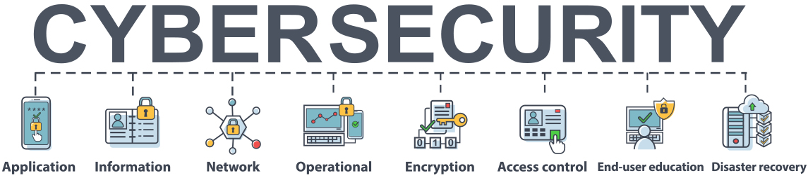

<!-- _class: cover_a-->
<!-- _paginate: "" -->
<!-- _footer: "" -->

# Cyber Security

Shi Jin
June 4, 2024

## About Me

- Shi Jin
- Institute of Information Engineering

- Major: Cyber Security
- Direction: High Performance Computing and Programming

## What is Cyber Security?

Cyber Security refers to the practice of **protecting** computers, servers, mobile devices, electronic systems, networks, and data from digital attacks, unauthorized access, and other cyber threats.

## Cyber Security is Close to us

<!-- _class: cols-2 -->

## Cryptography

<!-- _class: trans -->
<!-- _footer: "" -->
<!-- _paginate: "" -->

## Imagine the Simplest Case

## Encrypt using a key!

## why do we need high performance computing?

Encryption and Decryption are **Complex Mathematical Functions**.

- For Users: Faster Encryption and Decryption

- For Cryptanalysts: Faster Algorithm Implementation

## Thank You for Listening

<!-- _class: trans -->
<!-- _footer: "" -->
<!-- _paginate: "" -->
