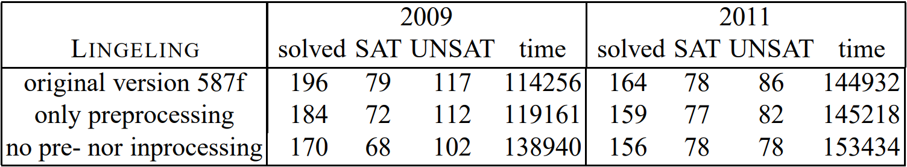

<!-- _class: cover_a-->
<!-- _paginate: "" -->
<!-- _footer: "" -->

# Inprocessing Rules

IJCAI 2012

## 研究动机

预处理(Preprocessing)：搜索前公式化简

内处理(Inprocessing)：搜索中公式化简

问题：简化技术的混合使用从理论上很难保证正确（可满足等价/逻辑等价）

## 冗余概念

- 解析：$C\otimes_l C'$​
  $$
  \{a,b,\neg c\},\{\neg a,d\} \to \{b,\neg c,d\}
  $$

- 重言：如果$C=\{x \lor \neg x \lor ...\}\in F$，那么$C_0$​是重言式​

- 包含：如果$C_1 \subset C_2$，而且$C_1,C_2 \in F$，那么$C_1$​被包含

- 阻塞：如果$l\in C\in F$，而且$\forall \neg l\in C'\in F$，有$C\otimes_l C'$是重言式，那么$C$被$l$​​阻塞
  $$
  \{\{a,b,c\},\{\neg a,\neg b\},\{\neg a,\neg c\}\} \\
  \to \{\{\neg a,\neg b\},\{\neg a,\neg c\}\}
  $$

  - 阻塞\=**解析重言**

- **解析包含**：如果$l\in C\in F$，而且$\forall \neg l\in C'\in F$，有$C\otimes_l C'$包含其他子句，那么$C$在$l$上解析包含
  $$
  \{\{a,b,c\},\{\neg a,d\},\{c,d\}\} \\
  \to \{\{a,b,c\},\{\neg a,d\}\}
  $$

## 文字添加

<!-- _class: cols-2-46 -->

- 隐含文字添加：$HLA(F,C)$
  如果$l_0\in C$，而且$(l_0 \lor l)\in F \backslash \{C\}$，那么令$C:=C\cup\{\neg l\}$​
- 非对称文字添加：$ALA(F,C)$
  如果$l_1,...,l_k \in C$，而且$(l_1\lor...\lor l_k \lor l)\in F \backslash \{C\}$，那么令$C:=C\cup \{\neg l\}$​

|            | 包含 | 重言 | 阻塞 | 解析重言 | 解析包含 |
| :--------: | :--: | :--: | :--: | :------: | :------: |
|            |  S   |  T   |  BC  |    RT    |    RS    |
| $HLA(F,C)$ |  HS  |  HT  | HBC  |   RHT    |   RHS    |
| $ALA(F,C)$ |  AS  |  AT  | ABC  |   RAT    |   RAS    |

## 内处理规则框架

公式状态：$\varphi [\rho]\sigma$：`不冗余子句[学习子句]文字:子句对`

- 学习(LEARN)：在前提条件X下，$\varphi [\rho]\sigma \to \varphi [\rho \land C]\sigma$​
  - X：$\varphi \land \rho$和$\varphi \land \rho \land C$​，可满足性等价（不是逻辑等价）
- 遗忘(FORGET)：$\varphi [\rho\land C]\sigma \to \varphi [\rho ]\sigma$
- 增强(STRENGTHEN)：$\varphi [\rho\land C]\sigma \to \varphi \land C[\rho ]\sigma$
- 削弱(WEAKEN)：在前提条件Y下，$\varphi\land C [\rho]\sigma \to \varphi [\rho \land C]\sigma,l:C$​
  - Y：$\varphi \land C$和$\varphi$​，可满足性等价（不是逻辑等价）

## 模型重建

基于RAT的内处理规则：

- 学习：$C$在$\varphi \land \rho$​中存在RAT
  - $\varphi=(a\lor b), \rho=\emptyset, C=(\neg a\lor\neg b)$
- 削弱：$C$的$l$在$\varphi$​​中存在RAT
  - $\varphi_0=(a\lor b)\land (\neg a\lor\neg b), \rho_0=\emptyset, \sigma_0=\langle\rangle$
  - $\varphi_1=(a\lor b) ,\rho_1=(\neg a\lor\neg b), \sigma_1=\langle\neg a:(\neg a \lor \neg b)\rangle$​

问题：$\varphi_1$的可满足赋值$\{1,1\}$，不是$\varphi_0$的可满足赋值

解决方法：$\sigma_1$​中的变量进行调节

## 贡献与评价

主要贡献：

- 总结了内处理规则的框架
- 给出了证明
- 将现有的技术用该框架进行解释

个人评价：

- 新技术符合框架规则就可以对正确性的保证

## 总结

SAT问题是数学中的一个基础问题，而逻辑学、图论、计算机科学和运筹学等领域中的众多问题都可以转化为SAT问题。为了提高SAT求解器的性能，现代求解器往往会使用多种推理规则对子句进行化简。这些操作在求解过程前被称为预处理，在求解过程中被称为内处理。本文的作者认为混合使用多种化简技术可能存在求解过程不完整的问题，缺乏相关的理论支持。于是作者通过分析现有的技术，提取出其中的关键步骤，绘制出化简技术之间的关系图，随后提出了一个内处理规则框架，并且证明只要遵循该框架就可以保证求解过程的完整性。作者还将被广泛认可的求解技术套用到框架中以证明框架的合理性。我认为这个内处理框架能够为未来SAT求解器的设计提供指导性的帮助。
