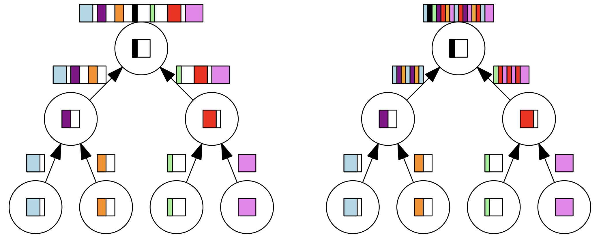

<!-- _class: cover_a-->
<!-- _paginate: "" -->
<!-- _footer: "" -->

# Scalable SAT Solving in the Cloud (Mallob)

SAT 2021

## 简介

- 并行赛道：1节点（64核+256GB）运行5000秒
- 云（分布式）赛道：100节点（16核+64G）运行1000秒，MPI通信

- HordeSat：2015年提出的分布式SAT求解框架（当时SAT竞赛还没有云赛道）
- Mallob：可扩展的、负载均衡的、去中心的、多任务的分布式SAT求解框架。

## 符号

环境：$m$个节点，每个节点$c$个计算单元，每个计算单元$t=4$个核心（线程）

任务分配的单位：计算单元，$p=c\cdot m$，同样也是MPI通信的单元​

任务：共$n$个任务$j\in\{1,...,n\}$，每个任务有对应的资源需求$d_j$​，即计算单元个数

## 任务分配

当任务$j$进入系统：

- 寻找一个空闲的计算单元$p_0(j)$​：稀疏正则图上的随机游走$r_0(j)$
  - 立方体：8节点的稀疏正则图
- 以$p_0(j)$为根构建任务树（完全二叉树），$v_j$为任务$j$实际占用的资源

根据SC的要求：一次只能运行一个任务，可以直接使用计算单元的物理地址构建任务树。

针对大规模任务出现内存恐慌(Memory Panic)：逐步减少每个计算单元中运行的顺序SAT示例个数，至少保证一个MPI负责一个。

## 子句通信

- 合并方法：2或3路归并
- 查重方法：可能存在两个不一样的子句$H_i(C_1)=H_i(C_2)$，仅对二元子句做额外的重复判断
  $$
  H_i(C)=\bigoplus_{l \in C}l\cdot primes\left[abs(l\cdot i) \mod \left|primes\right|\right]
  $$
- 缓存空间限制：$l(u)=\lceil u \cdot \alpha^{\log_2(u)}\cdot\beta \rceil$，其中$\beta$是默认缓冲区大小，$u$是合并数量，$\alpha\in[0.5,1]$是超参数
