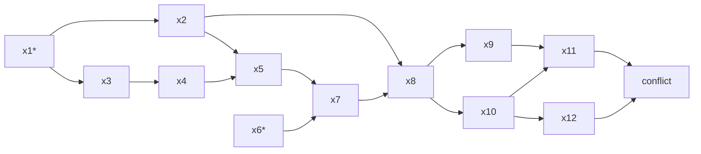

对SAT问题，DPLL/CDCL经典算法的简单介绍。

[:simple-slides: 幻灯片](../assets/SAT_0_简介/SAT_0_简介_marp.html){.md-button}

<!-- more -->

## 布尔可满足性问题

给定一个布尔公式，判断是否存在一种赋值，使得公式为真。

定理：所有布尔公式都可以转化为合取范式。

$$
\begin{align}
f &= c_1 \land c_2 \\
c_1 &= \lnot x_1 \lor \lnot x_2 \lor x_3 \\
c_2 &= \lnot x_3 \lor x_4
\end{align}
$$

Tseitin编码：通过引入新变量得到较短的合取范式（SAT问题与3-SAT问题等价）。

### 经典算法

- DPLL算法：猜变量+布尔约束传播（BCP）
- CDCL算法：冲突驱动子句学习

#### 布尔约束传播（BCP）

又被称为单位传播（UP）：当一个子句中除了一个文字之外的其他文字都为假时，可以确定该文字为真，迭代执行。

$$
\begin{align}
c_1 &= \lnot x_1 \lor \lnot x_2 \lor x_3 \\
c_2 &= \lnot x_3 \lor x_4
\end{align}
$$

## 子句学习

BCP完成后，如果存在文字全为假的子句（冲突子句），开始学习一个新子句（而不是单步回溯猜下一个变量）。[可视化演示](https://cse442-17f.github.io/Conflict-Driven-Clause-Learning/)

BCP过程的蕴含图（有向无环图）中，寻找独一蕴含点（UIP）：该点所有后继的前驱都来自该点的前驱。

First UIP策略：UIP一定存在且UIP可能存在多个，选择回溯时的第一个（x8）。

## 其他启发式方法

- 变量状态独立衰减总和（VSIDS）：在BCP过程中记录变量被推断的次数，猜变量时优先选择推断次数多的变量（增加局部性）。
- 启发式重新搜索
- 启发式简化或遗忘新学习的子句
- ……
